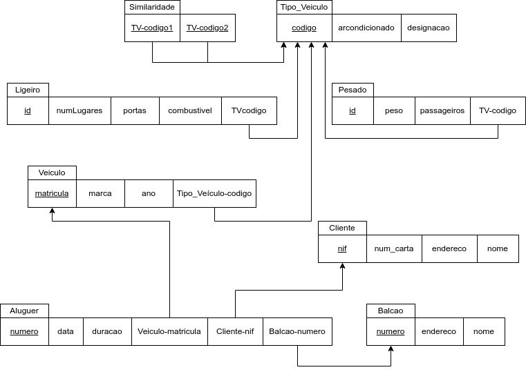
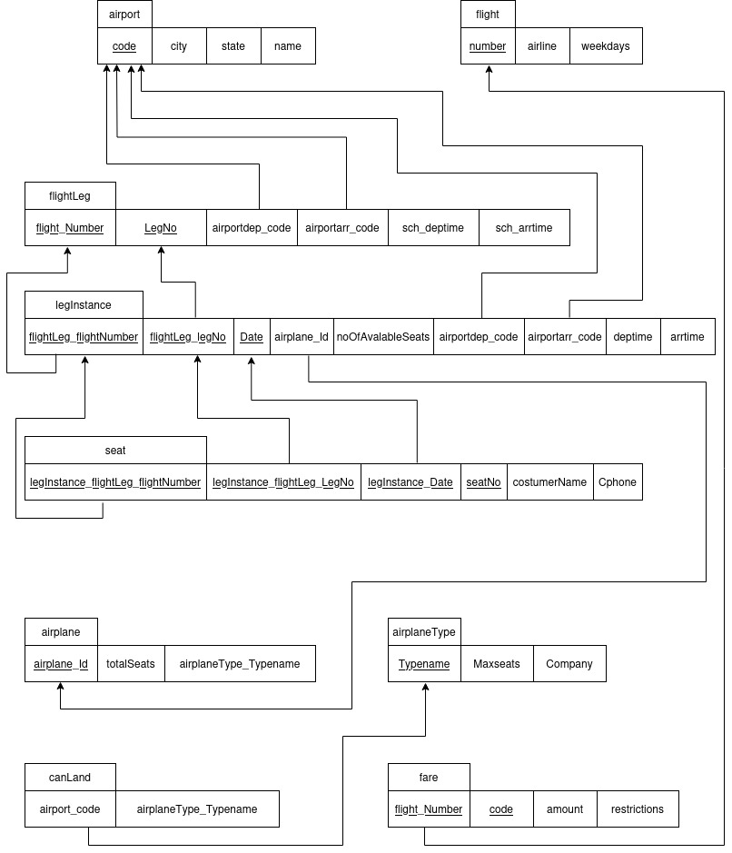
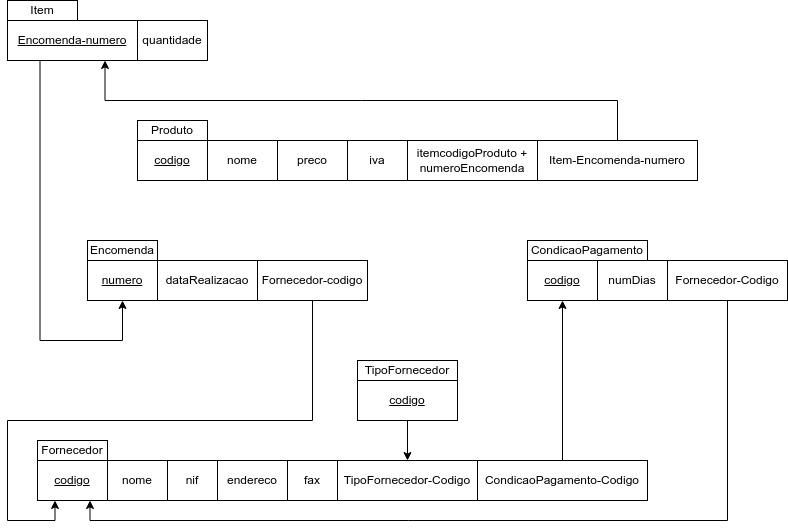
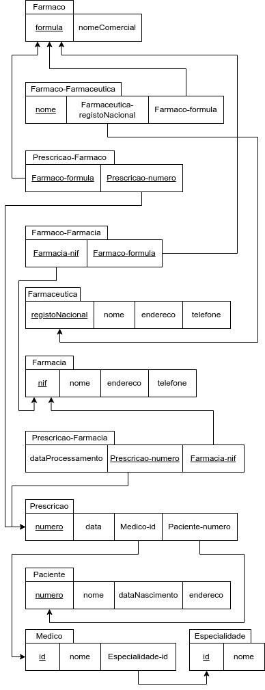
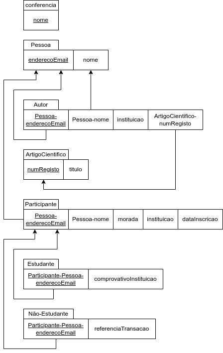
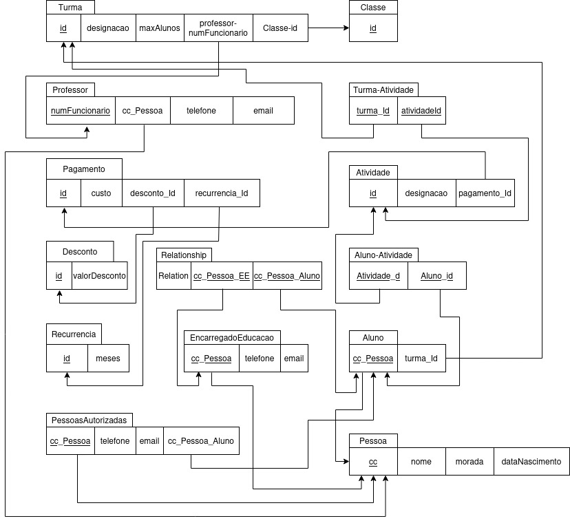

# BD: Guião 3


## ​Problema 3.1
 
### *a)*

```
cliente: NIF (PK) (CK), num_carta (CK), endereço, nome
balcao: numero (PK) (CK), endereco, nome
veiculo: matricula (PK) (CK), marca, ano, tipo_veiculo-codigo (FK)
tipo_veiculo: codigo (PK) (CK), arcondicionado , designacao
aluguer: numero (PK) (CK), date, duracao, cliente-nif (FK), veiculo-matricula (FK), balcao-numero (FK)
similaridade: TVcodigo1 (PK) (CK) (FK), TVcodigo2 (PK) (CK) (FK)
ligeiro: id (PK) (CK), TVcodigo (FK), numlugares, portas, combustível
pesado: id (PK) (CK), TVcodigo (FK), peso, passageiros
```


### *b)* 

```
cliente:
PK: NIF
CKs: NIF, num_carta
FKs:

balcao:
PK: numero
CKs: numero
FKs:

veiculo:
PK: matricula
CKs: matricula
FKs: tipo_veiculo-codigo

tipo_veiculo:
PK: codigo
CKs: codigo
FKs:

aluguer:
PK: numero
CKs: numero
FKs: cliente-nif, veiculo-matricula, balcao-numero

similaridade:
PK: TVcodigo1 + TVcodigo2
CKs: TVcodigo1 + TVcodigo2
FKs: TVcodigo1, TVcodigo2

ligeiro:
PK: id
CKs: id
FKs: TVcodigo

pesado:
PK: id
CKs: id
FKs: TVcodigo
```


### *c)* 




## ​Problema 3.2

### *a)*

```
airport: code, city, state, name
flight: number, airline, weekdays
flightLeg: flight_Number, LegNo, airportdep_code, airportarr_code, sch_deptime, scharrtime
legInstance: flightLeg_flightnumber, flightLeg_legNo, Date, airplane_Id,  noOfAvaiableSeats, airportdep_code, airportarr_code, deptime, arrtime
seat: legInstance_flightLeg_flightNumber, legInstance_flightLeg_LegNo, legInstance_Date, seatNo, costumerName, Cphone
airplane: AirplaneId, Totalseats, airplaneType_Typename
airplaneType: Typename, Maxseats, company
canLand: airport_code, airplaneType_Typename
fare: flight_Number, code, Amount, Restrictions
```


### *b)* 

```
airport:
PK: code
CKs: code, name + state + city
FKs:

flight:
PK: number
CKs: number
FKs:

flightLeg:
PK: FlightNumber + LegNo
CKs: FlightNumber + LegNo
FKs: FlightNumber, airportdep_code, airportarr_code, sch_deptime, sch_arrtime

legInstance:
PK: flightLeg_flightNumber + flightLeg_legNo + Date
CKs: flightLeg_flightNumber + flightLeg_legNo + Date
FKs: flightLeg_flightNumber, flightLeg_legNo, airplane_Id

seat:
PK: legInstance_flightLeg_FlightNumber + legInstance_flightLeg_LegNo + legInstance_Date + seatNo
CKs: legInstance_flightLeg_FlightNumber + legInstance_flightLeg_LegNo + legInstance_Date + seatNo
FKs: legInstance_flightLeg_FlightNumber, legInstance_flightLeg_LegNo, legInstance_Date

airplane:
PK: airplaneId
CKs: airplaneId
FKs: airplaneType_Typename

airplaneType:
PK: Typename
CKs: Typename
FKs:

canLand:
PK: airport_Code + airplaneType_Typename
CKs: airport_Code + airplaneType_Typename
FKs: airport_Code, airplaneType_Typename

fare:
PK: flight_Number + code
CKs: flight_Number + code
FKs: flight_Number
```


### *c)* 




## ​Problema 3.3


### *a)* 2.1



### *b)* 2.2



### *c)* 2.3



### *d)* 2.4

