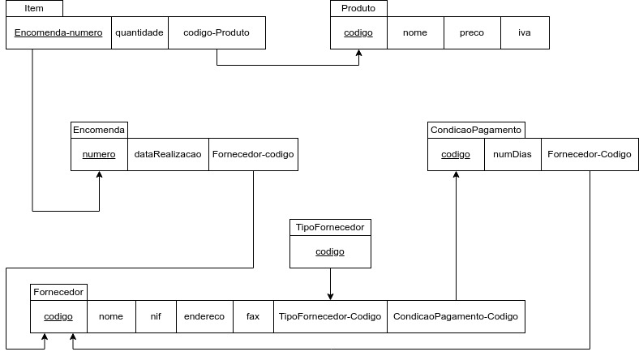

# BD: Guião 3


## ​Problema 3.1
 
### *a)*

```
cliente: NIF (PK) (CK), num_carta (CK), endereço, nome
balcao: numero (PK) (CK), endereco, nome
veiculo: matricula (PK) (CK), marca, ano, tipo_veiculo-codigo (FK)
tipo_veiculo: codigo (PK) (CK), arcondicionado , designacao
aluguer: numero (PK) (CK), date, duracao, cliente-nif (FK), veiculo-matricula (FK), balcao-numero (FK)
similaridade: TVcodigo1 (PK) (CK) (FK), TVcodigo2 (PK) (CK) (FK)
ligeiro: id (PK) (CK), TVcodigo (FK), numlugares, portas, combustível
pesado: id (PK) (CK), TVcodigo (FK), peso, passageiros
```


### *b)* 

```
cliente:
PK: NIF
CKs: NIF, num_carta
FKs:

balcao:
PK: numero
CKs: numero
FKs:

veiculo:
PK: matricula
CKs: matricula
FKs: tipo_veiculo-codigo

tipo_veiculo:
PK: codigo
CKs: codigo
FKs:

aluguer:
PK: numero
CKs: numero
FKs: cliente-nif, veiculo-matricula, balcao-numero

similaridade:
PK: TVcodigo1 + TVcodigo2
CKs: TVcodigo1 + TVcodigo2
FKs: TVcodigo1, TVcodigo2

ligeiro:
PK: id
CKs: id
FKs: TVcodigo

pesado:
PK: id
CKs: id
FKs: TVcodigo


```


### *c)* 


## ​Problema 3.2

### *a)*

```
airport: _code, city, state, name
flight: _number, airline, weekdays
flightLeg: ..FLIGHTNUMBER, __LEG_No, ..airportdep_code, ..airportarr_code, sch_deptime, scharrtime

legInstance: _(flightLeg(flightnumber,leg_no), __Date), Airplane_Id,  no_ofavaiableseats; airport_depcode, airportarrcode, deptime, arrtime
seat: (Leg_instance(até Date), _Seat_no, costumerName, Cphone
Airplane: _AirplaneId, Totalseats, airplanetype_Typename

AirplaneType: Typename, Maxseats, company
CanLand: _Airport_Airport_code, _AirplaneType Typename
Fare: _Flight_Number, _Code, Amount, Restrictions
```


### *b)* 

```
airport:
PK: code
CKs: code
FKs:

flight:
PK: number
CKs: number
FKs:

flightLeg:
PK: FlightNumber + LegNo
CKs: FlightNumber + LegNo
FKs: FlightNumber, airportdepCode, airportarrCode, sch_deptime, sch_arrtime


seat:
PK: flightLeg_FlightNumber + flightLeg_LegNo + Date
CKs: flightLeg_FlightNumber + flightLeg_LegNo + Date
FKs: 
```


### *c)* 


## ​Problema 3.3


### *a)* 2.1



### *b)* 2.2


### *c)* 2.3


### *d)* 2.4

